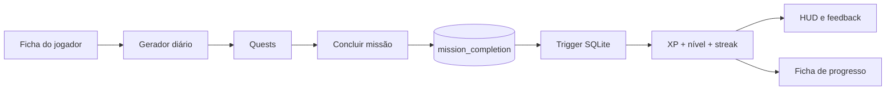
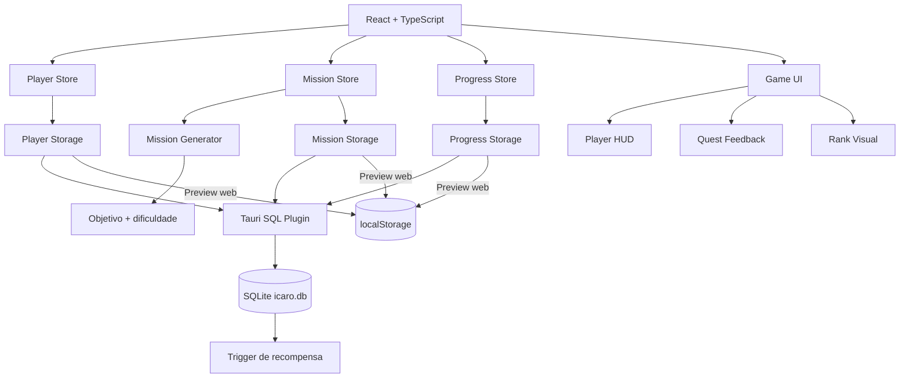

# I.C.A.R.O.

> **Índice de Condicionamento, Atividade, Rotina e Objetivos**

RPG open source de evolução pessoal baseado em atividade física. O I.C.A.R.O. transforma rotina, movimento e consistência em ficha, missões, XP, níveis e histórico de progresso, com foco em Android e funcionamento offline-first.

**Versão atual: `0.3.1`**

## Estado atual

A 0.3.1 é a release de **Game Feel**. A lógica de progressão da 0.3.0 continua como fonte da verdade, mas agora o aplicativo comunica essa evolução como um RPG de forma clara e rápida:

- HUD do jogador com nível, rank, XP, sequência e missões do dia;
- barra de XP animada;
- ranks visuais sem alterar a fórmula de progressão;
- missões apresentadas como quests;
- feedback imediato de conclusão e recompensa;
- overlay curto de level up;
- tela Progresso em formato de ficha de personagem;
- histórico visual dos últimos 7 dias;
- Perfil alinhado à linguagem da ficha do jogador;
- navegação inferior refinada e compatível com safe area;
- transições discretas com suporte a `prefers-reduced-motion`;
- persistência e proteção contra XP duplicado preservadas.

## Ciclo atual



Cada `mission_id` só pode existir uma vez em `mission_completion`. A animação reage ao estado persistido, nunca o contrário. Fechar o app, tocar duas vezes ou repetir a chamada não fabrica XP, porque aparentemente até um RPG precisa se defender do entusiasmo humano por apertar botões.

## Ranks

Rank é uma camada visual sobre o nível atual. Ele não altera XP nem dificuldade:

| Nível | Rank |
| --- | --- |
| 1–4 | Recruta |
| 5–9 | Iniciado |
| 10–19 | Explorador |
| 20–34 | Combatente |
| 35–49 | Veterano |
| 50–74 | Ascendente |
| 75–99 | Mestre |
| 100+ | Lendário |

## Regras de progressão

- cada missão concede XP uma única vez;
- o jogador começa no nível 1;
- o primeiro nível exige 500 XP;
- ao subir de nível, o próximo requisito aumenta 15%;
- a sequência avança quando há ao menos uma conclusão em dias consecutivos;
- completar várias missões no mesmo dia aumenta XP, mas não a sequência;
- se houver um intervalo de mais de um dia, a sequência recomeça em 1.

## Arquitetura



## Stack

- Tauri 2
- React 19 + TypeScript
- Vite
- Framer Motion
- Zustand
- React Hook Form + Zod
- `@tauri-apps/plugin-sql`
- Rust
- SQLite
- GitHub Actions
- Health Connect / Kotlin (planejado)

## Direção visual

A referência visual oficial é **[Impeccable](https://impeccable.style/)**.

O sistema local está em [`DESIGN.md`](./DESIGN.md). A 0.3.1 usa uma linguagem de **RPG futurista sóbrio + HUD de personagem + fitness**: preto/cinza como base, dourado reservado para ação/progresso, tipografia forte, divisores e spacing no lugar de caixas dentro de caixas.

## Testar como Android no PC

O caminho recomendado é o **Android Emulator do Android Studio**. Ele executa o pacote Android real, então Tauri, WebView, SQLite e comportamento do sistema Android entram no teste.

Depois de configurar Android Studio, SDK/NDK e targets Rust:

```bash
npm install
npm run android:init
npm run android:dev
```

Para abrir o projeto Android gerado no Android Studio:

```bash
npm run android:studio
```

Guia completo: [`docs/ANDROID_TESTING.md`](./docs/ANDROID_TESTING.md).

## Roadmap

| Versão | Foco | Estado |
| --- | --- | --- |
| `0.0.1` | Scaffold Android/Tauri e primeira identidade visual | ✅ |
| `0.1.0` | Ficha, SQLite e catálogo de exercícios | ✅ |
| `0.2.0` | Missões diárias baseadas na ficha e dificuldade | ✅ |
| `0.3.0` | XP, nível, streak e progressão persistente | ✅ |
| `0.3.1` | Game Feel: HUD, ranks, quests e feedback | ✅ |
| `0.3.2` | Conquistas, marcos, histórico e resumo semanal | Próxima |
| `0.4.0` | Health Connect, passos, distância e validação automática | Planejada |
| `0.5.0` | Expansão da evolução e visualizações | Planejada |
| `0.6.0` | Notificações, refinamento e preparação de distribuição | Planejada |

## Desenvolvimento

Frontend rápido:

```bash
npm install
npm run dev
```

Tauri desktop:

```bash
npm run tauri dev
```

Android Emulator:

```bash
npm run android:dev
```

Build Android:

```bash
npm run android:build
```

## Persistência

As migrations atuais criam:

- `player_profile`;
- `daily_mission`;
- `player_progress`;
- `mission_completion`;
- trigger `award_mission_completion`.

A 0.3.1 não adiciona estado persistido para animações, rank ou feedback. No runtime nativo, a verdade continua em `sqlite:icaro.db`. O preview web usa localStorage para desenvolvimento rápido.

## Estrutura principal

```text
src/
├── components/
│   └── game/
│       ├── LevelUpOverlay.tsx
│       ├── MissionCompletion.tsx
│       ├── MissionReward.tsx
│       ├── PlayerHud.tsx
│       ├── RankBadge.tsx
│       └── XpBar.tsx
├── data/
├── lib/
│   ├── progression.ts
│   └── ranks.ts
├── stores/
└── types/

src-tauri/
├── capabilities/
└── src/

docs/
├── ANDROID_TESTING.md
└── PRODUCT.md
```

## Licença

A licença será definida antes da primeira release pública estável.
