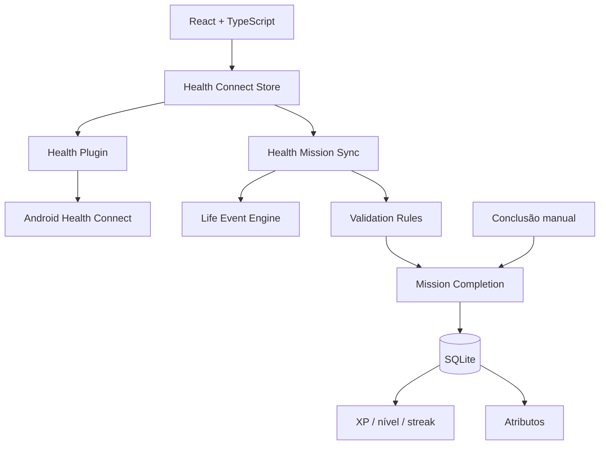

# I.C.A.R.O.

> **Índice de Condicionamento, Atividade, Rotina e Objetivos**

RPG open source de evolução pessoal que usa a vida real como input. Atividade registrada no Android vira evidência, passa por regras explícitas e só então pode virar missão concluída, atributo, XP, nível e histórico.

**Versão atual: `0.4.0`**

## 0.4.0 — Health Connect

A 0.4.0 conecta o Life Event Engine ao Android.

O aplicativo agora pode:

- detectar disponibilidade do Health Connect;
- pedir somente leitura de passos, distância e sessões de exercício;
- respeitar acesso parcial ou revogado;
- montar um snapshot diário local;
- registrar passos, distância e treinos como Life Events idempotentes;
- validar automaticamente missões compatíveis;
- manter conclusão manual para tudo que não puder ser verificado;
- mostrar passos, distância e minutos de treino na tela Hoje;
- abrir as configurações do Health Connect para o usuário gerenciar permissões.

Health Connect **não concede XP diretamente**. Ele fornece evidência. A recompensa continua passando pelas mesmas regras e pela mesma proteção contra duplicidade usadas na conclusão manual.

## Fluxo


## Dados lidos

A 0.4.0 solicita apenas:

- passos;
- distância;
- sessões de exercício.

A integração é somente leitura e não exige nuvem.

### Missões verificáveis hoje

| Missão / padrão | Evidência |
| --- | --- |
| Distância de caminhada | distância diária |
| Minutos ativos | duração somada de treinos |
| Caminhada leve | minutos em sessão de caminhada |
| Sessão mínima | maior sessão contínua |
| Mobilidade | yoga/pilates registrados |

Missões de repetições e atividades sem evidência confiável continuam manuais. O software poderia fingir que sabe quantos agachamentos você fez. Felizmente, ainda temos algum amor pela realidade.

## Idempotência

- passos e distância usam uma chave por dia e são atualizados, não duplicados;
- sessões de exercício usam chave derivada da sessão;
- uma missão continua tendo apenas uma conclusão;
- sincronizar várias vezes não fabrica XP;
- atividade bruta entra com zero pontos de atributo;
- pontos são concedidos apenas quando uma regra de progressão é satisfeita.

## Arquitetura



O plugin de saúde é usado com commit fixado e apenas os recursos `steps`, `distance` e `workouts` habilitados.

## Stack

- Tauri 2
- React 19 + TypeScript
- Vite
- Framer Motion
- Zustand
- React Hook Form + Zod
- SQLite + `@tauri-apps/plugin-sql`
- Rust
- Health Connect
- GitHub Actions

## Direção visual

A referência oficial continua sendo **[Impeccable](https://impeccable.style/)**.

A integração de saúde aparece como uma camada discreta de contexto, não como mais um dashboard cheio de cartões. O sistema visual está em [`DESIGN.md`](./DESIGN.md).

## Rodar

Frontend:

```bash
npm install
npm run dev
```

Android:

```bash
npm install
npm run android:init
npm run android:dev
```

Guia de Android e Health Connect: [`docs/ANDROID_TESTING.md`](./docs/ANDROID_TESTING.md).

## Roadmap

| Versão | Foco | Estado |
| --- | --- | --- |
| `0.0.1` | Scaffold Android/Tauri | ✅ |
| `0.1.0` | Ficha, SQLite e exercícios | ✅ |
| `0.2.0` | Missões diárias | ✅ |
| `0.3.0` | XP, nível e streak | ✅ |
| `0.3.1` | Game Feel | ✅ |
| `0.3.2` | Life Event Engine e atributos | ✅ |
| `0.4.0` | Health Connect como fonte real | ✅ |
| `0.4.x` | Mais regras e sincronização refinada | Próxima |
| `0.5.0` | Progressão profunda, marcos e visualizações | Planejada |
| `0.6.0` | Notificações e distribuição | Planejada |

## Persistência

A fonte da verdade local continua em `sqlite:icaro.db`:

- `player_profile`;
- `daily_mission`;
- `player_progress`;
- `mission_completion`;
- `player_attribute`;
- `life_event`.

O preview web continua disponível para UI, mas Health Connect é uma capacidade nativa Android.

## Documentação

- [Produto](./docs/PRODUCT.md)
- [Life Event Engine](./docs/LIFE_EVENT_ENGINE.md)
- [Release 0.4.0](./docs/RELEASE_0.4.0.md)
- [Android / Health Connect](./docs/ANDROID_TESTING.md)
- [Design System](./DESIGN.md)

## Licença

A licença será definida antes da primeira release pública estável.
