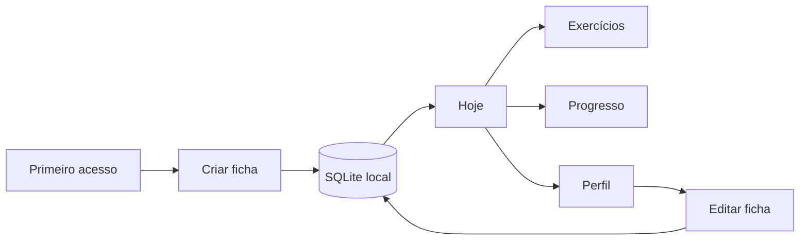

# I.C.A.R.O.

> **Índice de Condicionamento, Atividade, Rotina e Objetivos**

RPG open source de evolução pessoal baseado em atividade física. O I.C.A.R.O. transforma rotina, movimento e consistência em ficha, missões, XP, níveis e histórico de progresso, com foco em Android e funcionamento offline-first.

**Versão atual: `0.1.0`**

## Estado atual

A 0.1.0 transforma o scaffold inicial em um produto que já possui **identidade persistente local**:

- ficha do jogador com nome, altura, peso, objetivo e dificuldade;
- SQLite nativo no runtime Tauri;
- migration versionada para o banco local;
- fallback em localStorage para preview pelo navegador;
- catálogo inicial de exercícios com filtros;
- edição da ficha;
- navegação entre Hoje, Exercícios, Progresso e Perfil;
- sistema visual documentado em `DESIGN.md`.

## Fluxo atual



## Arquitetura

```mermaid
flowchart TD
  UI[React + TypeScript] --> STORE[Zustand]
  STORE --> REPO[Player Storage]
  REPO -->|Tauri| SQL[@tauri-apps/plugin-sql]
  SQL --> DB[(SQLite icaro.db)]
  REPO -->|Preview web| LS[(localStorage)]
  UI --> TAURI[Tauri 2]
  TAURI --> CORE[Rust Core]
  CORE --> HC[Health Connect - planejado]
```

O SQLite é inicializado pelo plugin SQL do Tauri e recebe migrations registradas no Rust. A versão web existe como preview de desenvolvimento; a persistência nativa é o caminho principal do produto.

## Catálogo inicial

A biblioteca da 0.1.0 começa pequena e legível, com exercícios de:

- caminhada;
- força;
- mobilidade;
- recuperação.

A 0.2.0 conecta esse catálogo à geração das missões diárias.

## Stack

- Tauri 2
- React 19 + TypeScript
- Vite
- Framer Motion
- Zustand
- React Hook Form + Zod
- `@tauri-apps/plugin-sql`
- Rust
- SQLite
- Health Connect / Kotlin (planejado)

## Direção visual

A referência visual oficial é **[Impeccable](https://impeccable.style/)**.

O sistema visual próprio está em [`DESIGN.md`](./DESIGN.md). As regras centrais são:

- hierarquia clara antes de decoração;
- menos caixas, mais spacing, tipografia e divisores;
- uma ação principal evidente por contexto;
- mobile-first de verdade;
- estados de foco e interação preservados;
- nada de gradiente genérico, métricas decorativas ou “AI slop”.

## Roadmap

| Versão | Foco | Estado |
| --- | --- | --- |
| `0.0.1` | Scaffold Android/Tauri e primeira identidade visual | ✅ |
| `0.1.0` | Ficha, SQLite e catálogo de exercícios | ✅ |
| `0.2.0` | Missões diárias baseadas na ficha e dificuldade | Próxima |
| `0.3.0` | XP, level, streak e regras de progressão persistentes | Planejada |
| `0.4.0` | Health Connect e integração com smartwatch | Planejada |
| `0.5.0` | Histórico e visualização da evolução | Planejada |
| `0.6.0` | Notificações, refinamento e preparação de distribuição | Planejada |

## Regra de release

Toda nova versão deve atualizar no mesmo ciclo:

1. código;
2. `CHANGELOG.md`;
3. números de versão;
4. **README.md** com estado atual e roadmap;
5. `DESIGN.md` quando a linguagem visual mudar.

Porque documentação desatualizada é só ficção histórica com syntax highlighting.

## Desenvolvimento

```bash
npm install
npm run dev
```

Para executar no Tauri:

```bash
npm run tauri dev
```

A aplicação nativa requer Rust. O alvo Android também exige SDK/NDK configurados.

## Persistência

O schema inicial contém `player_profile` e é criado por migration. As permissões do plugin ficam explícitas em `src-tauri/capabilities/default.json`.

Nenhuma conta online é necessária na 0.1.0.

## Estrutura principal

```text
src/
├── components/
├── data/
├── lib/
├── stores/
└── types/

src-tauri/
├── capabilities/
└── src/

docs/
└── PRODUCT.md
```

## Licença

A licença será definida antes da primeira release pública estável.
