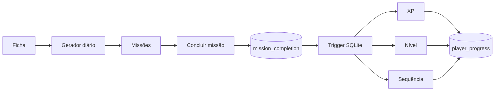

# I.C.A.R.O.

> **Índice de Condicionamento, Atividade, Rotina e Objetivos**

RPG open source de evolução pessoal baseado em atividade física. O I.C.A.R.O. transforma rotina, movimento e consistência em ficha, missões, XP, níveis e histórico de progresso, com foco em Android e funcionamento offline-first.

**Versão atual: `0.3.0`**

## Estado atual

A 0.3.0 fecha o primeiro ciclo completo de progressão local:

- ficha persistente do jogador;
- SQLite nativo no runtime Tauri;
- catálogo inicial de exercícios;
- três missões geradas por dia;
- metas e recompensas ajustadas por objetivo e dificuldade;
- conclusão manual de missão;
- XP persistente;
- nível persistente;
- sequência diária persistente;
- proteção contra recompensa duplicada;
- CI de TypeScript/Vite;
- fluxo de release por branch + Pull Request;
- teste Android no PC documentado com Android Emulator.

## Ciclo atual



Cada `mission_id` só pode existir uma vez em `mission_completion`. A atualização de XP, nível e sequência é disparada pelo banco apenas depois de uma nova conclusão aceita. Resultado: clicar duas vezes, reabrir o app ou repetir a chamada não fabrica XP.

## Regras de progressão

- cada missão concede XP uma única vez;
- o jogador começa no nível 1;
- o primeiro nível exige 500 XP;
- ao subir de nível, o próximo requisito aumenta 15%;
- a sequência avança quando há ao menos uma conclusão em dias consecutivos;
- completar várias missões no mesmo dia aumenta XP, mas não a sequência;
- se houver um intervalo de mais de um dia, a sequência recomeça em 1.

Essas regras ainda são deliberadamente simples. A ideia é tornar a progressão previsível antes de sofisticá-la.

## Arquitetura

```mermaid
flowchart TD
  UI[React + TypeScript] --> PLAYER[Player Store]
  UI --> MISSIONS[Mission Store]
  UI --> PROGRESS[Progress Store]

  PLAYER --> PREPO[Player Storage]
  MISSIONS --> GEN[Mission Generator]
  MISSIONS --> MREPO[Mission Storage]
  PROGRESS --> GREPO[Progress Storage]

  PREPO --> SQL[@tauri-apps/plugin-sql]
  MREPO --> SQL
  GREPO --> SQL

  SQL --> DB[(SQLite icaro.db)]
  DB --> TRIGGER[Trigger de recompensa]

  GEN --> PROFILE[Objetivo + dificuldade]

  PREPO -->|Preview web| LS[(localStorage)]
  MREPO -->|Preview web| LS
  GREPO -->|Preview web| LS
```

## Stack

- Tauri 2
- React 19 + TypeScript
- Vite
- Framer Motion
- Zustand
- React Hook Form + Zod
- `@tauri-apps/plugin-sql`
- Rust
- SQLite
- GitHub Actions
- Health Connect / Kotlin (planejado)

## Direção visual

A referência visual oficial é **[Impeccable](https://impeccable.style/)**.

O sistema local está em [`DESIGN.md`](./DESIGN.md). A interface prioriza hierarquia, leitura rápida, feedback explícito e divisores/spacing no lugar de uma epidemia de cards.

## Testar como Android no PC

O caminho recomendado é o **Android Emulator do Android Studio**. Ele executa o pacote Android real, então Tauri, WebView, SQLite e comportamento do sistema Android entram no teste.

Depois de configurar Android Studio, SDK/NDK e targets Rust:

```bash
npm install
npm run android:init
npm run android:dev
```

Para abrir o projeto Android gerado no Android Studio:

```bash
npm run android:studio
```

Guia completo: [`docs/ANDROID_TESTING.md`](./docs/ANDROID_TESTING.md).

## Roadmap

| Versão | Foco | Estado |
| --- | --- | --- |
| `0.0.1` | Scaffold Android/Tauri e primeira identidade visual | ✅ |
| `0.1.0` | Ficha, SQLite e catálogo de exercícios | ✅ |
| `0.2.0` | Missões diárias baseadas na ficha e dificuldade | ✅ |
| `0.3.0` | XP, nível, streak e progressão persistente | ✅ |
| `0.4.0` | Health Connect e integração com smartwatch | Próxima |
| `0.5.0` | Histórico e visualização da evolução | Planejada |
| `0.6.0` | Notificações, refinamento e preparação de distribuição | Planejada |

## Processo de versão

Cada versão é desenvolvida numa branch `release/X.Y.Z` e acompanhada por um Pull Request para `main`. O PR começa como draft enquanto a versão está em construção.

Toda versão atualiza no mesmo ciclo:

1. código;
2. `CHANGELOG.md`;
3. números de versão;
4. **README.md**;
5. `DESIGN.md` quando a linguagem visual mudar;
6. PR com resumo, escopo e validação;
7. CI antes do merge.

Detalhes: [`docs/RELEASE_PROCESS.md`](./docs/RELEASE_PROCESS.md).

## Desenvolvimento

Frontend rápido:

```bash
npm install
npm run dev
```

Tauri desktop:

```bash
npm run tauri dev
```

Android Emulator:

```bash
npm run android:dev
```

Build Android:

```bash
npm run android:build
```

## Persistência

As migrations atuais criam:

- `player_profile`;
- `daily_mission`;
- `player_progress`;
- `mission_completion`;
- trigger `award_mission_completion`.

No runtime nativo, tudo vive em `sqlite:icaro.db`. O preview web usa localStorage para desenvolvimento rápido.

## Estrutura principal

```text
src/
├── components/
├── data/
├── lib/
├── stores/
└── types/

src-tauri/
├── capabilities/
└── src/

docs/
├── ANDROID_TESTING.md
├── PRODUCT.md
└── RELEASE_PROCESS.md
```

## Licença

A licença será definida antes da primeira release pública estável.
