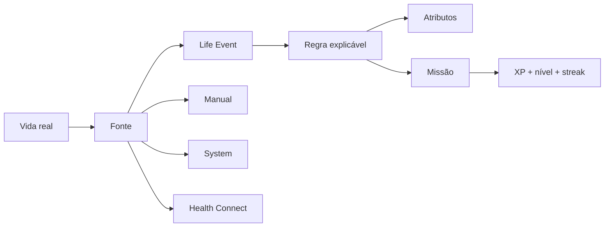
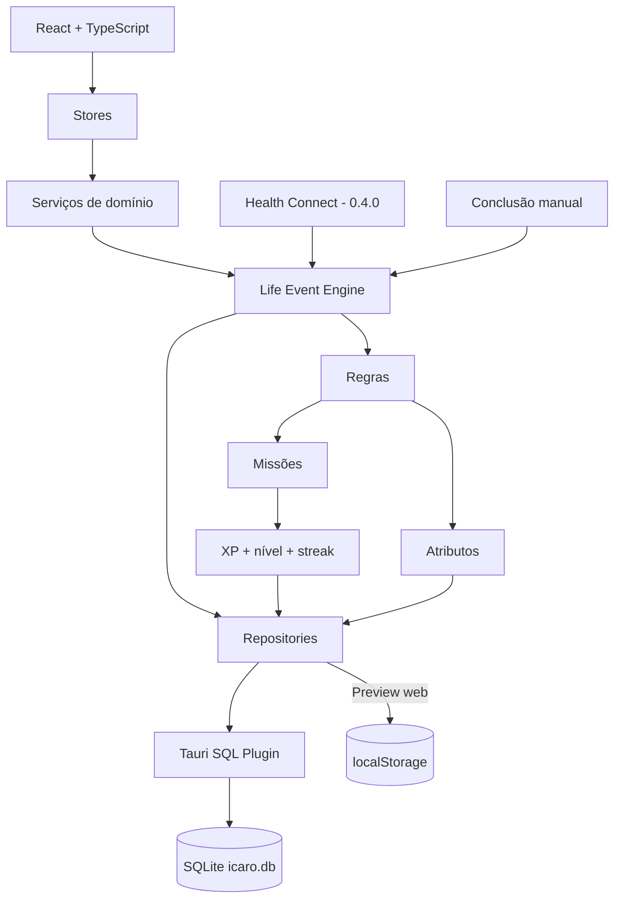

# I.C.A.R.O.

> **Índice de Condicionamento, Atividade, Rotina e Objetivos**

RPG open source de evolução pessoal baseado em atividade física. O I.C.A.R.O. transforma atividade real em eventos normalizados e, a partir deles, em atributos, missões, XP, níveis, sequência e histórico de progresso. O foco continua sendo Android, offline-first e regras explicáveis.

**Versão atual: `0.3.2`**

## Estado atual

A 0.3.2 inaugura o **Life Event Engine**.

A partir desta versão, a progressão deixa de depender diretamente do gesto de marcar um checklist. Toda atividade relevante pode ser representada por um evento canônico com fonte, tipo, quantidade, unidade, referência, metadados e uma `dedupe_key` idempotente.

Hoje as fontes disponíveis no contrato são:

- `MANUAL`
- `SYSTEM`
- `HEALTH_CONNECT`

Health Connect ainda não é lido nesta release. A 0.3.2 constrói a fundação para que a 0.4.0 possa receber dados Android sem acoplar integração de sistema à lógica de XP.

## Ciclo atual



O objetivo é simples: o usuário não deve precisar abrir o aplicativo para provar tudo o que viveu.

## Atributos

A evolução passa a ter duas camadas complementares:

- **XP e nível** representam progresso global;
- **atributos** mostram como esse progresso está acontecendo.

Atributos iniciais:

| Atributo | Papel |
| --- | --- |
| Condicionamento | esforço cardiorrespiratório, distância e sessões relacionadas |
| Força | sessões e missões ligadas a força |
| Mobilidade | atividades de mobilidade, alongamento e movimento |
| Constância | recorrência e disciplina ao longo do tempo |

Esses valores são progressão de jogo derivada de regras explícitas. Não são diagnóstico de saúde nem tentam fingir uma precisão científica que o aplicativo não possui.

## Idempotência

Cada Life Event possui uma `dedupe_key` única.

Isso impede que a mesma atividade seja recompensada duas vezes mesmo que:

- o usuário toque novamente;
- uma integração reenvie o mesmo registro;
- o aplicativo seja reiniciado;
- uma reconciliação seja executada.

As missões já concluídas podem ser reconciliadas com o novo motor sem duplicar XP.

## Game Feel

A camada visual criada na 0.3.1 continua preservada:

- HUD do jogador;
- barra de XP;
- ranks;
- quests;
- feedback de recompensa;
- overlay de level up;
- ficha de progresso;
- histórico recente;
- navegação mobile-first;
- suporte a `prefers-reduced-motion`.

A 0.3.2 adiciona à tela Progresso a leitura de atributos persistentes e de Life Events recentes.

## Arquitetura



Documentação técnica do motor: [`docs/LIFE_EVENT_ENGINE.md`](./docs/LIFE_EVENT_ENGINE.md).

## Stack

- Tauri 2
- React 19 + TypeScript
- Vite
- Framer Motion
- Zustand
- React Hook Form + Zod
- `@tauri-apps/plugin-sql`
- Rust
- SQLite
- GitHub Actions
- Health Connect / Kotlin (próxima fase)

## Direção visual

A referência visual oficial é **[Impeccable](https://impeccable.style/)**.

O sistema visual está em [`DESIGN.md`](./DESIGN.md). A linguagem continua sendo **RPG futurista sóbrio + HUD de personagem + fitness**: preto/cinza como base, dourado reservado para ação/progresso, tipografia forte, divisores e spacing no lugar de uma epidemia de cards.

## Testar como Android no PC

O caminho recomendado é o **Android Emulator do Android Studio**.

```bash
npm install
npm run android:init
npm run android:dev
```

Para abrir o projeto Android gerado no Android Studio:

```bash
npm run android:studio
```

Guia completo: [`docs/ANDROID_TESTING.md`](./docs/ANDROID_TESTING.md).

## Roadmap

| Versão | Foco | Estado |
| --- | --- | --- |
| `0.0.1` | Scaffold Android/Tauri e primeira identidade visual | ✅ |
| `0.1.0` | Ficha, SQLite e catálogo de exercícios | ✅ |
| `0.2.0` | Missões diárias baseadas na ficha e dificuldade | ✅ |
| `0.3.0` | XP, nível, streak e progressão persistente | ✅ |
| `0.3.1` | Game Feel: HUD, ranks, quests e feedback | ✅ |
| `0.3.2` | Life Event Engine, atributos e reconciliação | ✅ |
| `0.4.0` | Health Connect como fonte real de eventos | Próxima |
| `0.4.x` | Regras automáticas para passos, distância e treino | Planejada |
| `0.5.0` | Progressão profunda, marcos e visualizações | Planejada |
| `0.6.0` | Notificações, refinamento e preparação de distribuição | Planejada |

## Desenvolvimento

Frontend rápido:

```bash
npm install
npm run dev
```

Tauri desktop:

```bash
npm run tauri dev
```

Android Emulator:

```bash
npm run android:dev
```

Build Android:

```bash
npm run android:build
```

## Persistência

As migrations atuais criam:

- `player_profile`;
- `daily_mission`;
- `player_progress`;
- `mission_completion`;
- `player_attribute`;
- `life_event`;
- trigger de recompensa da missão;
- trigger de aplicação de pontos de atributo.

No runtime nativo, a verdade fica em `sqlite:icaro.db`. O preview web usa localStorage para desenvolvimento rápido.

## Documentação

- [Produto](./docs/PRODUCT.md)
- [Life Event Engine](./docs/LIFE_EVENT_ENGINE.md)
- [Design System](./DESIGN.md)
- [Teste Android](./docs/ANDROID_TESTING.md)

## Licença

A licença será definida antes da primeira release pública estável.
