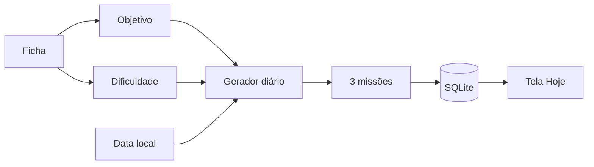

# I.C.A.R.O.

> **Índice de Condicionamento, Atividade, Rotina e Objetivos**

RPG open source de evolução pessoal baseado em atividade física. O I.C.A.R.O. transforma rotina, movimento e consistência em ficha, missões, XP, níveis e histórico de progresso, com foco em Android e funcionamento offline-first.

**Versão atual: `0.2.0`**

## Estado atual

A 0.2.0 liga a ficha do jogador ao primeiro sistema realmente dinâmico do projeto: **missões diárias geradas a partir de objetivo + dificuldade**.

Hoje o projeto já possui:

- ficha persistente do jogador;
- SQLite nativo no runtime Tauri;
- catálogo inicial de exercícios;
- três missões geradas por dia;
- metas e recompensas ajustadas pela dificuldade;
- seleção orientada pelo objetivo do jogador;
- persistência das missões para que o dia não rerrole a cada abertura;
- fallback web em localStorage;
- CI de TypeScript/Vite no GitHub Actions;
- sistema visual documentado em `DESIGN.md`.

## Como as missões funcionam



O gerador usa a data local como parte da semente. Se as missões daquele dia já existem no banco, elas são reutilizadas. Abrir e fechar o app não é uma máquina caça-níquel de tarefas.

## Arquitetura

```mermaid
flowchart TD
  UI[React + TypeScript] --> PLAYER[Player Store]
  UI --> MISSIONS[Mission Store]
  PLAYER --> PREPO[Player Storage]
  MISSIONS --> GEN[Mission Generator]
  MISSIONS --> MREPO[Mission Storage]
  PREPO --> SQL[@tauri-apps/plugin-sql]
  MREPO --> SQL
  SQL --> DB[(SQLite icaro.db)]
  GEN --> PROFILE[Objetivo + dificuldade]
  PREPO -->|Preview web| LS[(localStorage)]
  MREPO -->|Preview web| LS
```

## Regras atuais do gerador

- sempre há uma missão de movimento;
- uma segunda missão recebe mais peso do objetivo escolhido;
- a terceira equilibra constância, força ou mobilidade;
- missões não se repetem no mesmo dia quando há alternativa;
- dificuldade `Leve`, `Padrão` e `Intensa` altera meta e XP;
- os números continuam deliberadamente conservadores nesta fase.

A 0.3.0 transforma XP, nível, conclusão e sequência em estado persistente, em vez de valores de demonstração.

## Stack

- Tauri 2
- React 19 + TypeScript
- Vite
- Framer Motion
- Zustand
- React Hook Form + Zod
- `@tauri-apps/plugin-sql`
- Rust
- SQLite
- GitHub Actions
- Health Connect / Kotlin (planejado)

## Direção visual

A referência visual oficial é **[Impeccable](https://impeccable.style/)**.

O sistema local está em [`DESIGN.md`](./DESIGN.md). A interface prioriza hierarquia, leitura rápida, divisores e spacing em vez de despejar card em cima de card até a tela pedir socorro.

## Roadmap

| Versão | Foco | Estado |
| --- | --- | --- |
| `0.0.1` | Scaffold Android/Tauri e primeira identidade visual | ✅ |
| `0.1.0` | Ficha, SQLite e catálogo de exercícios | ✅ |
| `0.2.0` | Missões diárias baseadas na ficha e dificuldade | ✅ |
| `0.3.0` | XP, level, streak e regras de progressão persistentes | Próxima |
| `0.4.0` | Health Connect e integração com smartwatch | Planejada |
| `0.5.0` | Histórico e visualização da evolução | Planejada |
| `0.6.0` | Notificações, refinamento e preparação de distribuição | Planejada |

## Regra de release

Toda versão atualiza no mesmo ciclo:

1. código;
2. `CHANGELOG.md`;
3. números de versão;
4. **README.md**;
5. `DESIGN.md` quando a linguagem visual mudar.

## Desenvolvimento

```bash
npm install
npm run dev
```

Para Tauri:

```bash
npm run tauri dev
```

O CI executa `npm install` e `npm run build` em pushes e pull requests para `main`.

## Persistência

As migrations atuais criam:

- `player_profile`;
- `daily_mission`.

No runtime nativo, ambos vivem em `sqlite:icaro.db`. O preview web usa localStorage para manter desenvolvimento rápido sem fingir que navegador é Android.

## Estrutura principal

```text
src/
├── components/
├── data/
├── lib/
├── stores/
└── types/

src-tauri/
├── capabilities/
└── src/

docs/
└── PRODUCT.md
```

## Licença

A licença será definida antes da primeira release pública estável.
