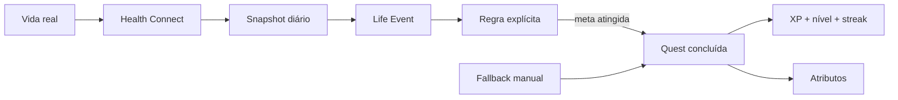
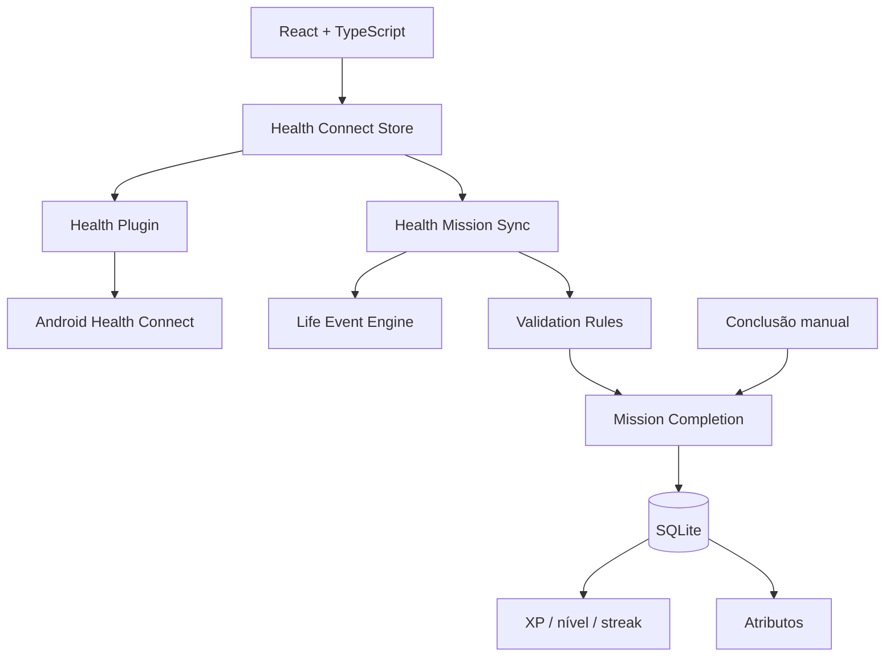

<div align="center">
  

# I.C.A.R.O.

### Índice de Condicionamento, Atividade, Rotina e Objetivos

**Um RPG de evolução pessoal em que a vida real é o input.**

Atividade registrada no Android vira evidência, passa por regras explícitas e só então pode virar missão concluída, atributo, XP, nível e histórico.

[](./CHANGELOG.md)
[](https://github.com/tombemol/I.C.A.R.O/actions/workflows/ci.yml)
[](./docs/ANDROID_TESTING.md)
[](https://tauri.app/)
[](#)

**[Site do projeto](https://tombemol.github.io/I.C.A.R.O/)** · **[Como rodar](#rodar-localmente)** · **[Roadmap](#roadmap)** · **[Documentação](#documentação)**

</div>

---

## A ideia

A maioria dos apps de produtividade gamificada funciona assim:

```text
você marca uma tarefa → o app acredita → você recebe pontos
```

O I.C.A.R.O. segue outra direção:

```text
vida real → evidência → Life Event → regra → progressão
```

O objetivo é reduzir a distância entre **o que aconteceu de verdade** e **o que o personagem representa**.

> **XP mostra quanto você evoluiu. Atributos mostram como você evoluiu.**

---

## 0.4.2 · Android OEM compatibility

A 0.4.2 completa o hotfix Android depois de um daqueles momentos em que "o ELF está alinhado" não significa, infelizmente, "o APK inteiro está certo".

Além do alinhamento de 16 KiB da biblioteca Rust, o projeto Android gerado agora fixa o **NDK r28**, usa **empacotamento JNI moderno**, mantém o **R8 em modo de compatibilidade** e a CI verifica tanto o alinhamento ZIP do APK quanto **todas** as bibliotecas nativas ARM64 antes de publicar uma release.

Isso cobre também a classe de falha em que alguns firmwares OEM encerram o app antes da WebView e exibem um alerta sobre "técnicas de reforço de segurança".

## 0.4.1 · Primeiro hotfix de 16 KiB

A 0.4.1 corrige a inicialização em aparelhos Android 15+ que usam páginas de memória de **16 KiB**. O binário ARM64 agora é ligado com alinhamento compatível, o pipeline usa NDK r28 e a própria CI inspeciona a biblioteca nativa antes de publicar o APK.

A integração Health Connect e as regras de progressão da 0.4.0 continuam iguais.

## 0.4.0 · Health Connect

A versão atual é a primeira em que o Android entra como fonte real de dados.

<table>
<tr>
<td width="33%"><strong>Passos</strong><br><sub>Leitura diária via Health Connect.</sub></td>
<td width="33%"><strong>Distância</strong><br><sub>Usada como evidência para quests compatíveis.</sub></td>
<td width="33%"><strong>Treinos</strong><br><sub>Sessões, duração e tipo de atividade.</sub></td>
</tr>
</table>

O Health Connect é **read-only** no I.C.A.R.O. e não concede XP diretamente. Ele fornece evidência. A recompensa continua passando pelas mesmas regras, pela persistência local e pela proteção contra duplicidade.

### O que já pode ser validado automaticamente

| Quest | Evidência real |
| --- | --- |
| Distância de caminhada | distância diária |
| Minutos ativos | duração acumulada de sessões |
| Caminhada leve | minutos em sessão de caminhada |
| Sessão mínima | maior sessão contínua |
| Mobilidade | yoga/pilates registrados |

Repetições e atividades sem evidência confiável continuam manuais. O software poderia fingir que viu seu agachamento. Preferimos a inconveniência da realidade.

---

## Como funciona



### Atributos

O motor mantém quatro eixos independentes da barra global de XP:

| Atributo | O que representa |
| --- | --- |
| **Condicionamento** | movimento, distância e esforço cardiorrespiratório |
| **Força** | sessões e quests de força |
| **Mobilidade** | mobilidade, alongamento e atividades relacionadas |
| **Constância** | recorrência e disciplina ao longo do tempo |

Eles são **mecânicas de jogo derivadas de regras explicáveis**, não métricas médicas.

---

## Arquitetura



### Stack

| Camada | Tecnologia |
| --- | --- |
| App | React 19 + TypeScript + Vite |
| Native shell | Tauri 2 + Rust |
| Estado | Zustand |
| Persistência | SQLite |
| Motion | Framer Motion |
| Dados de atividade | Android Health Connect |
| CI | GitHub Actions |
| Site | GitHub Pages |

---

## Princípios de produto

**Offline-first.** A nuvem não é requisito para existir.

**Vida real como input.** O checklist é fallback, não a visão de produto.

**Explicável.** Uma recompensa precisa ter uma regra que possa ser entendida.

**Idempotente.** Sincronizar duas vezes não cria duas vidas paralelas com XP grátis.

**Saúde antes de gamificação.** O sistema não deve premiar comportamento irresponsável.

**Automação sem perda de controle.** Permissões podem ser parciais, negadas ou revogadas.

---

## Roadmap

| Versão | Foco | Estado |
| --- | --- | :---: |
| `0.0.1` | Scaffold Android/Tauri | ✅ |
| `0.1.0` | Ficha, SQLite e exercícios | ✅ |
| `0.2.0` | Missões diárias | ✅ |
| `0.3.0` | XP, nível e streak | ✅ |
| `0.3.1` | Game Feel | ✅ |
| `0.3.2` | Life Event Engine e atributos | ✅ |
| `0.4.0` | Health Connect como fonte real | ✅ |
| `0.4.1` | Primeiro hotfix Android 15+ / ELF 16 KiB | ✅ |
| `0.4.2` | Empacotamento Android/OEM + validação integral do APK | ✅ |
| `0.4.x` | Mais regras e sincronização refinada | 🔨 |
| `0.5.0` | Progressão profunda, marcos e visualizações | ◻️ |
| `0.6.0` | Notificações e distribuição | ◻️ |

---

## Rodar localmente

### Frontend

```bash
npm install
npm run dev
```

### Android

```bash
npm install
npm run android:init
npm run android:dev
```

Para abrir o projeto Android no Android Studio:

```bash
npm run android:studio
```

O guia completo de emulator, SDK, NDK e Health Connect está em [`docs/ANDROID_TESTING.md`](./docs/ANDROID_TESTING.md).

---

## Persistência

A fonte da verdade local é `sqlite:icaro.db`.

```text
player_profile
daily_mission
player_progress
mission_completion
player_attribute
life_event
```

Life Events usam `dedupe_key`, e cada missão só pode gerar uma conclusão. A sincronização pode repetir. A recompensa não.

---

## Identidade visual

O símbolo do I.C.A.R.O. usa **duas asas**, uma referência direta ao mito de Ícaro, envolvendo um **I** central sob um disco solar.

A direção continua sendo:

> **RPG futurista sóbrio + fitness + mitologia, sem neon gratuito e sem interface de cassino.**

A referência de qualidade visual do projeto é [Impeccable](https://impeccable.style/). O sistema completo está em [`DESIGN.md`](./DESIGN.md).

---

## Documentação

- [Produto](./docs/PRODUCT.md)
- [Life Event Engine](./docs/LIFE_EVENT_ENGINE.md)
- [Release 0.4.0](./docs/RELEASE_0.4.0.md)
- [Android / Health Connect](./docs/ANDROID_TESTING.md)
- [Design System](./DESIGN.md)
- [Changelog](./CHANGELOG.md)

---

<div align="center">

### Suba. Mas deixe os dados provarem.

**I.C.A.R.O. · v0.4.2**

<sub>Projeto open source. Não é um dispositivo médico nem substitui orientação profissional de saúde.</sub>

</div>
