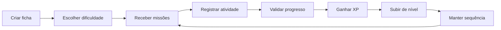
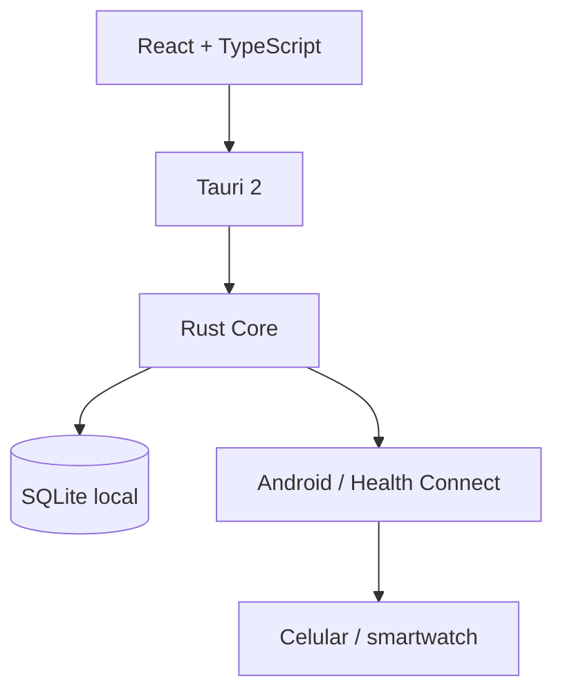

# I.C.A.R.O.

> **Índice de Condicionamento, Atividade, Rotina e Objetivos**

RPG open source de evolução pessoal baseado em atividade física. O I.C.A.R.O. transforma rotina, movimento e consistência em missões, XP, níveis e histórico de progresso, com foco em Android e funcionamento offline-first.

**Versão atual: `0.0.1`**

## O que já existe na 0.0.1

- Base React + TypeScript + Vite.
- Estrutura Tauri 2 pronta para evolução mobile.
- Tela inicial mobile-first.
- Protótipo de missões diárias.
- XP, nível e sequência modelados no frontend.
- Zustand preparado para estado local.
- Direção de produto documentada em `docs/PRODUCT.md`.

## Ciclo do jogador



## Arquitetura planejada



O frontend cuida da experiência. O core em Rust concentrará regras de missões, XP, níveis, dificuldade, penalidades e segurança. SQLite mantém o progresso local. A integração Android/Health Connect entra depois para validar passos, distância e sessões.

## Stack

- Tauri 2
- React 19 + TypeScript
- Vite
- Framer Motion
- Zustand
- React Hook Form + Zod
- Rust
- SQLite (próxima fase)
- Health Connect / Kotlin (fase posterior)

## Direção visual

A referência visual oficial é **[Impeccable](https://impeccable.style/)**. O objetivo é fugir de interface genérica de IA: hierarquia clara, poucos elementos competindo pela atenção, ações específicas, densidade controlada e ornamento só quando melhora compreensão.

## Roadmap

| Versão | Foco |
| --- | --- |
| `0.0.1` | Scaffold Android/Tauri e primeira identidade visual |
| `0.1.0` | Ficha, SQLite e catálogo de exercícios |
| `0.2.0` | Missões diárias e dificuldade |
| `0.3.0` | XP, level, streak e penalidades |
| `0.4.0` | Health Connect e integração com smartwatch |
| `0.5.0` | Histórico e visualização da evolução |
| `0.6.0` | Notificações, refinamento e preparação de distribuição |

## Regra de release

Toda nova versão deve atualizar, no mesmo ciclo de entrega:

1. código;
2. `CHANGELOG.md`;
3. número da versão;
4. **README.md** com estado atual e roadmap.

Porque software muda. README também deveria, apesar da aparente resistência cultural da espécie.

## Desenvolvimento

```bash
npm install
npm run dev
```

Para Tauri:

```bash
npm run tauri dev
```

> O build Tauri exige toolchain Rust e, para Android, os pré-requisitos do SDK/NDK configurados.

## Licença

Licença ainda será definida antes da primeira release pública estável.
