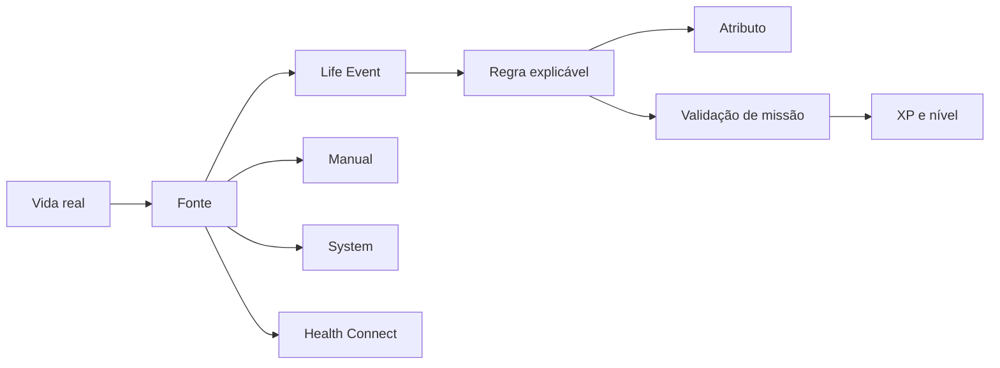

# Life Event Engine

A partir da 0.3.2, o I.C.A.R.O. trata atividade real como eventos normalizados antes de transformar qualquer coisa em progressão.

## Pipeline

## Contrato de evento

Todo evento possui:

- tipo;
- data operacional;
- fonte;
- quantidade/unidade quando aplicável;
- referência externa ou interna;
- `dedupe_key` idempotente;
- atributo afetado e pontos concedidos, quando houver;
- metadados serializáveis.

O motor não deve conhecer APIs específicas do Android. Health Connect será apenas uma fonte que produz eventos no mesmo formato das demais.

## Atributos iniciais

- Condicionamento
- Força
- Mobilidade
- Constância

A 0.3.2 não substitui XP nem níveis. Ela adiciona uma camada independente de atributos para que a evolução possa representar o que o usuário realmente fez, e não apenas quantos botões marcou.

## Regras

1. Um mesmo `dedupe_key` só gera efeito uma vez.
2. Eventos são fatos; efeitos são derivados por regras explícitas.
3. A fonte não altera arbitrariamente a recompensa.
4. O Health Connect nunca se torna fonte da verdade do jogo inteiro.
5. Falha de integração externa não apaga progresso local.
6. Missões antigas concluídas devem ser reconciliáveis com o motor.

## 0.4.0

A integração Android deverá converter passos, distância e sessões de exercício em Life Events. A lógica de progressão continuará fora da camada Kotlin.
