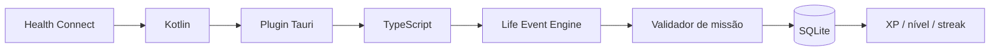

# I.C.A.R.O. 0.4.0 — Health Connect

## Objetivo

Trocar parte da conclusão manual por evidência vinda do Android, mantendo o I.C.A.R.O. offline-first e com permissões explícitas.

## Estratégia técnica

A integração será implementada por uma camada nativa Android em Kotlin exposta ao Tauri por plugin mobile. O código não deve viver apenas em `src-tauri/gen/android`, porque esse diretório é gerado e ignorado pelo Git.

## Dados iniciais

Primeiro recorte:

- passos;
- distância;
- sessões de exercício.

Permissões de leitura previstas:

- `android.permission.health.READ_STEPS`;
- `android.permission.health.READ_DISTANCE`;
- `android.permission.health.READ_EXERCISE`.

A implementação pedirá apenas as permissões necessárias para recursos habilitados.

## Fluxo

## Fases

1. plugin móvel e detecção de disponibilidade;
2. fluxo de permissões;
3. leitura de passos/distância/exercícios;
4. normalização para um snapshot diário;
5. conversão em Life Events;
6. validação automática das missões compatíveis;
7. fallback manual para missões que não possam ser verificadas;
8. testes no Android Emulator;
9. README, CHANGELOG e DESIGN.

## Teste alvo

Usar Android Emulator com Android 14 / API 34 ou superior e Google Play Services. Health Connect faz parte do framework no Android 14+, o que simplifica o ambiente de teste.

## Segurança e privacidade

- sem upload obrigatório para nuvem;
- solicitar o mínimo de permissões;
- explicar o motivo de cada permissão antes do prompt do sistema;
- permitir que o app continue útil sem Health Connect;
- manter a decisão final de permissões com o usuário.
