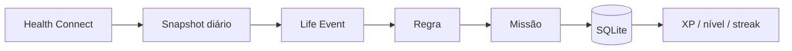

# I.C.A.R.O. 0.4.0 — Health Connect

## Objetivo

Usar atividade real do Android como evidência de progressão, sem tornar o Health Connect obrigatório.

## Implementação

A integração usa um plugin Tauri de saúde fixado em um commit conhecido e com apenas três recursos habilitados:

- passos;
- distância;
- sessões de exercício.

O plugin fornece a ponte nativa para Health Connect. O código de domínio do I.C.A.R.O. continua separado da API Android.

## Pipeline

## Regras

1. Health Connect é evidência, nunca economia.
2. Passos e distância do mesmo dia são atualizados por upsert.
3. Treinos têm chave idempotente por sessão.
4. Atividade bruta entra sem pontos de atributo.
5. A recompensa só acontece pela conclusão de missão.
6. Manual e automático compartilham a mesma proteção contra duplicidade.
7. Permissões são solicitadas apenas depois de ação explícita.
8. O app funciona sem integração.

## Cobertura automática inicial

- distância diária;
- minutos totais de exercício;
- minutos de caminhada;
- maior sessão contínua;
- minutos de yoga/pilates para mobilidade.

Repetições continuam manuais porque o dado disponível não comprova a execução de cada repetição.

## Privacidade

- read-only;
- local-first;
- sem nuvem obrigatória;
- permissões mínimas;
- acesso parcial suportado;
- usuário pode gerenciar/revogar no Android.

## Validação da release

- frontend TypeScript + Vite;
- build Android automatizado;
- roteiro de runtime/emulador documentado em `ANDROID_TESTING.md`.

## Resultado

A 0.4.0 é o primeiro ponto em que o I.C.A.R.O. realmente recebe a vida do usuário como input em vez de depender apenas do usuário declarar que cumpriu uma tarefa.
