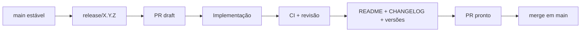

# Processo de release do I.C.A.R.O.

Cada versão deve manter um histórico explícito de desenvolvimento e revisão.

## Fluxo

## Regras

1. Criar `release/X.Y.Z` a partir da `main`.
2. Abrir um PR **draft** para `main` assim que a branch tiver o primeiro commit.
3. Fazer todo o trabalho da versão nessa branch.
4. Manter o PR atualizado com escopo, mudanças e pendências.
5. Antes do merge:
   - CI verde;
   - versão atualizada onde aplicável;
   - `CHANGELOG.md` atualizado;
   - `README.md` atualizado;
   - `DESIGN.md` atualizado se a interface mudou;
   - documentação técnica atualizada quando necessário.
6. Marcar o PR como pronto apenas quando a versão estiver fechada.
7. Fazer merge em `main`.
8. Manter a branch `release/X.Y.Z` como referência histórica, salvo decisão posterior de limpeza.

## Versões antigas

As versões 0.1.0 e 0.2.0 foram originalmente desenvolvidas diretamente na `main`. Foram criadas branches históricas apontando para seus commits reais. Não serão criados PRs retroativos falsos, porque histórico de engenharia deveria registrar o que aconteceu, não uma versão mais bonita do passado.
